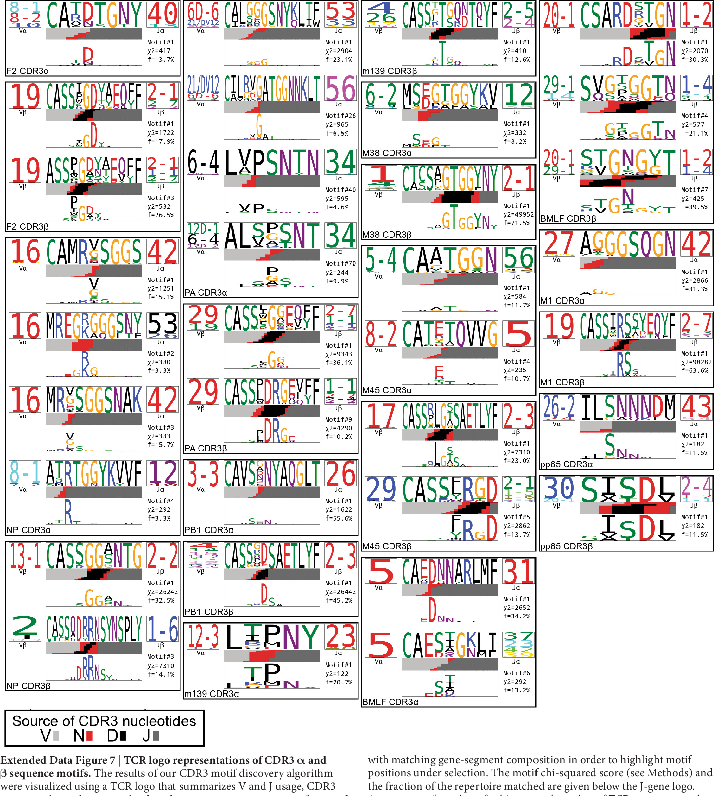
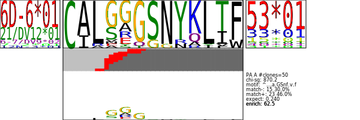

# tcrregex


Suppose you've done some flashywork with [tcrdist3](https://tcrdist3.readthedocs.io/en/latest/#), our research group's open-source Python package that enables a broad array of flexible T cell receptor sequence analyses; however, you are old-school and you want regex motif patterns and the classic motif plots as they were developed in the original [TCRdist 2017 scripts suite](https://github.com/phbradley/tcr-dist) associated with the Dash et al. Nature (2017) [doi:10.1038/nature22383](https://www.semanticscholar.org/paper/Quantifiable-predictive-features-define-T-cell-Dash-Fiore-Gartland/b3e8d6f21fbdcd58888af31e791b5a8d24a1c592/figure/2) manuscript. 




## Install 

```
pip install git+https://github.com/kmayerb/tcrregex.git
```


## Download Data Files

After install, download key background files. THIS IS NOT OPTIONAL.

```
python -c "import tcrregex as td; td.install_test_files.install_test_files()"
python -c "import tcrregex as td; td.setup_db.install_all_next_gen()"
python -c "import tcrregex as td; td.setup_blast.install_blast_to_externals(download_from = 'dropbox_osx')"
```

## Usage

First, with tcrdist3: 

```python
import pandas as pd
from tcrdist.repertoire import TCRrep

df = pd.read_csv("dash.csv")
tr = TCRrep(cell_df = df, 
            organism = 'mouse', 
            chains = ['alpha','beta'], 
            db_file = 'alphabeta_gammadelta_db.tsv')
```

Now,  boot up the tcrregex package


```python
from tcrregex.subset import TCRsubset
from tcrregex.cdr3_motif import TCRMotif
from tcrregex.storage import StoreIOMotif, StoreIOEntropy
from tcrregex import plotting

# define a logical criteria
ind = (tr.clone_df.epitope == "PA")

# subset the TCRrep clone DataFrame to only those sequences meeting that criteria
clone_df_subset = tr.clone_df[ind].reset_index(drop = True).copy()

# subset the alpha chain and beta chain distance matrices using the `clone_df_subset.clone_id` index
dist_a_subset = pd.DataFrame(tr.pw_alpha[ind,:][:,ind])
dist_b_subset = pd.DataFrame(tr.pw_beta[ind,:][:,ind])
assert dist_a_subset.shape[0] == clone_df_subset.shape[0]
assert dist_a_subset.shape[1] == clone_df_subset.shape[0]
assert dist_b_subset.shape[0] == clone_df_subset.shape[0]
assert dist_b_subset.shape[1] == clone_df_subset.shape[0]

from tcrregex.subset import TCRsubset
from tcrregex.mappers import populate_legacy_fields
assert isinstance(dist_a_subset, pd.DataFrame)
assert isinstance(dist_b_subset, pd.DataFrame)
assert isinstance(clone_df_subset, pd.DataFrame)

# use the populate_legacy_fields function to add some columns needed for compatability with tcrdist1
clone_df_subset = populate_legacy_fields(df = clone_df_subset, chains =['alpha', 'beta'])

# FOR DEMO ONLY: Limit the sarch to first 100 seqs
clone_df_subset = clone_df_subset.iloc[0:50, :].copy()
dist_b_subset = dist_b_subset.iloc[0:50, 0:50].copy()
dist_a_subset = dist_a_subset.iloc[0:50, 0:50].copy()

# initialize an instance of the TCRsubset class.
ts = TCRsubset(clone_df_subset,
            organism = "mouse",
            epitopes = ["PA"] ,
            epitope = "PA",
            chains = ["A","B"],
            dist_a = dist_a_subset,
            dist_b = dist_b_subset)

# Chilax this step can take forever! 
#ts.find_motif()

# So make sure to save your motifs DataFrame 
#ts.motif_df.to_csv("saved_motifs.csv", index = False)

# You can always reload these and skip the wait
ts.motif_df = pd.read_csv("saved_motifs.csv")

# Output alpha-chain motifs
motif_list_a = list()
motif_logos_a = list()
for i,row in ts.motif_df[ts.motif_df.ab == "A"].iterrows():
    StoreIOMotif_instance = ts.eval_motif(row)
    motif_list_a.append(StoreIOMotif_instance)
    motif_logos_a.append(plotting.plot_pwm(StoreIOMotif_instance, create_file = False, my_height = 200, my_width = 600))

with open('alpha_motifs.html' , 'w') as outfile:
  outfile.write('<html>\n')
  for motif in motif_list_a:
    svg = plotting.plot_pwm(motif, create_file = False, my_height = 200, my_width = 600)
    outfile.write(f"<div>{svg}</div>")
  outfile.write('</html>\n')

# Output beta-chain motifs
motif_list_b = list()
motif_logos_b = list()
for i,row in ts.motif_df[ts.motif_df.ab == "B"].iterrows():
    StoreIOMotif_instance = ts.eval_motif(row)
    motif_list_b.append(StoreIOMotif_instance)
    motif_logos_b.append(plotting.plot_pwm(StoreIOMotif_instance, create_file = False, my_height = 200, my_width = 600))

with open('beta_motifs.html' , 'w') as outfile:
  outfile.write('<html>\n')
  for motif in motif_list_b:
    svg = plotting.plot_pwm(motif, create_file = False, my_height = 200, my_width = 600)
    outfile.write(f"<div>{svg}</div>")
  outfile.write('</html>\n')
```

Example Output Files:




